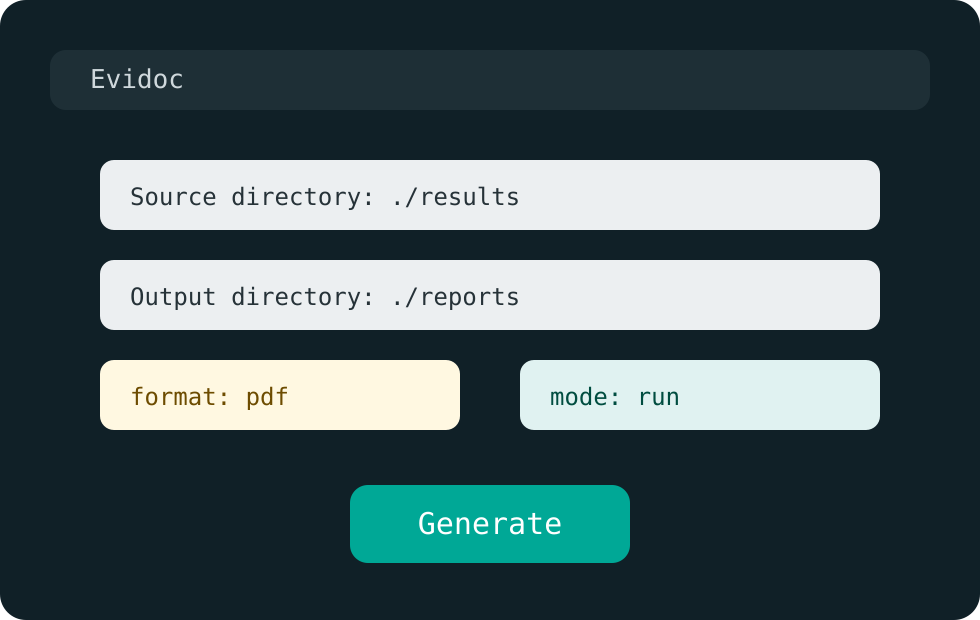

# TUI

## Cuando usarla

La TUI es util cuando alguien necesita generar reportes sin memorizar comandos, pero aun quiere elegir parametros tecnicos concretos.

## Lanzamiento

```powershell
poetry run evidoc tui
```

## Campos visibles

| Campo | Descripcion |
| --- | --- |
| `Source directory` | Carpeta de resultados |
| `Output directory` | Carpeta destino |
| `format` | `pdf` o `docx` |
| `mode` | `run` o `single` |

## Flujo recomendado

1. Define `source_dir`.
2. Define `output_dir`.
3. Elige formato.
4. Elige modo.
5. Presiona `Generate`.

## Que esperar

La interfaz notifica:

- las rutas generadas si hubo reportes,
- o `No results found` si no hay datos validos.


