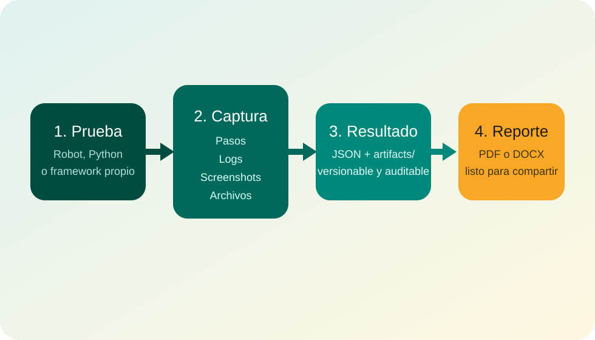

# Manual tecnico de usuario

  

    
Fuente de verdad operativa

    <h1>Evidoc convierte la evidencia de prueba en reportes legibles, auditables y reutilizables.</h1>
    

      Este manual esta orientado a usuarios finales tecnicos: testers funcionales, testers de automatizacion,
      desarrolladores y cualquier perfil que necesite capturar evidencia, entender su estructura y generar reportes
      PDF o DOCX sin depender de interpretaciones ambiguas.
    

    

      <a class="md-button md-button--primary" href="primeros-pasos/instalacion/">Empezar instalacion</a>
      <a class="md-button" href="guias/">Ir a las guias tecnicas</a>
    

  

  

???+ abstract "Que resuelve Evidoc"
    Evidoc separa dos preocupaciones que normalmente se mezclan en un proyecto de pruebas:

    1. **Capturar evidencia estructurada** mientras se ejecuta una prueba.
    2. **Convertir esa evidencia en un entregable** legible por negocio, QA y auditoria.

    Esa separacion permite cambiar la forma de ejecucion sin perder consistencia en la salida.

- :material-compass-outline:{ .lg .middle } __Entender antes de ejecutar__

    ---

    Revisa el [panorama funcional](panorama/index.md) para entender conceptos, perfiles y el modelo operativo completo.

- :material-rocket-launch-outline:{ .lg .middle } __Levantar el flujo minimo__

    ---

    Sigue [primeros pasos](primeros-pasos/index.md) si necesitas instalar, configurar y producir tu primer reporte rapido.

- :material-console-line:{ .lg .middle } __Elegir interfaz__

    ---

    La seccion [guias tecnicas](guias/index.md) cubre CLI, TUI, Python API y Robot Framework con ejemplos completos.

- :material-book-open-page-variant-outline:{ .lg .middle } __Consultar la referencia__

    ---

    Usa [referencia](referencia/index.md) para revisar esquemas, comandos, keywords, estados y convenciones exactas.

## Rutas rapidas por perfil

=== "Tester funcional"

    Empieza en [Recorrido guiado](primeros-pasos/recorrido-guiado.md), luego pasa a [TUI](guias/tui.md) y termina con [Reportes y salidas](guias/reportes-y-salidas.md).

=== "Tester de automatizacion"

    Prioriza [Robot Framework](guias/robot-framework.md), [CLI](guias/cli.md) y [Estructura de resultados](referencia/estructura-de-resultados.md).

=== "Desarrollador"

    Empieza por [Modelo operativo](panorama/modelo-operativo.md), sigue con [Python API](guias/python-api.md) y valida contratos en [Referencia](referencia/index.md).

=== "Lider QA / auditoria tecnica"

    Ve primero a [Que es Evidoc](panorama/que-es-evidoc.md), despues [Reportes y salidas](guias/reportes-y-salidas.md) y cierra con [Buenas practicas](operacion/buenas-practicas.md).

## Capacidades cubiertas por este manual

- Captura de pasos, logs, screenshots y archivos adjuntos.
- Generacion de reportes por corrida completa o por prueba individual.
- Uso desde CLI, interfaz TUI, API Python y Robot Framework.
- Estructura exacta del resultado almacenado en disco.
- Configuracion por archivo `evidoc.json` o `evidoc.toml`.
- Limitaciones operativas, convenciones y troubleshooting.
