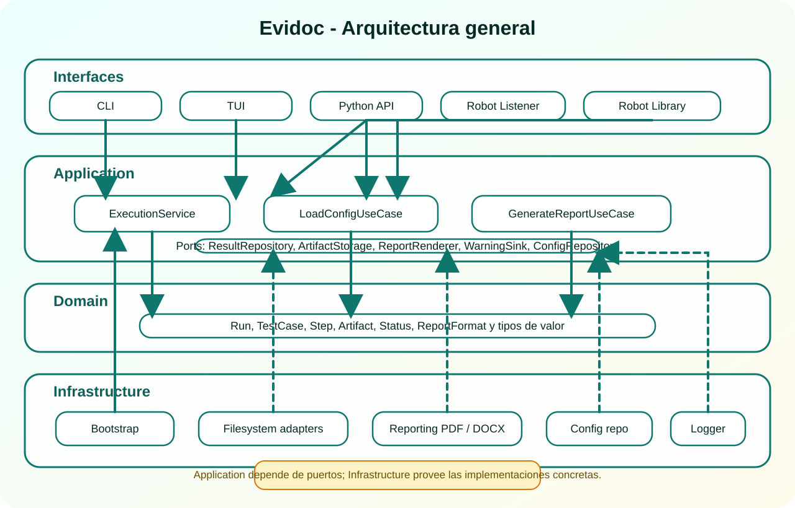
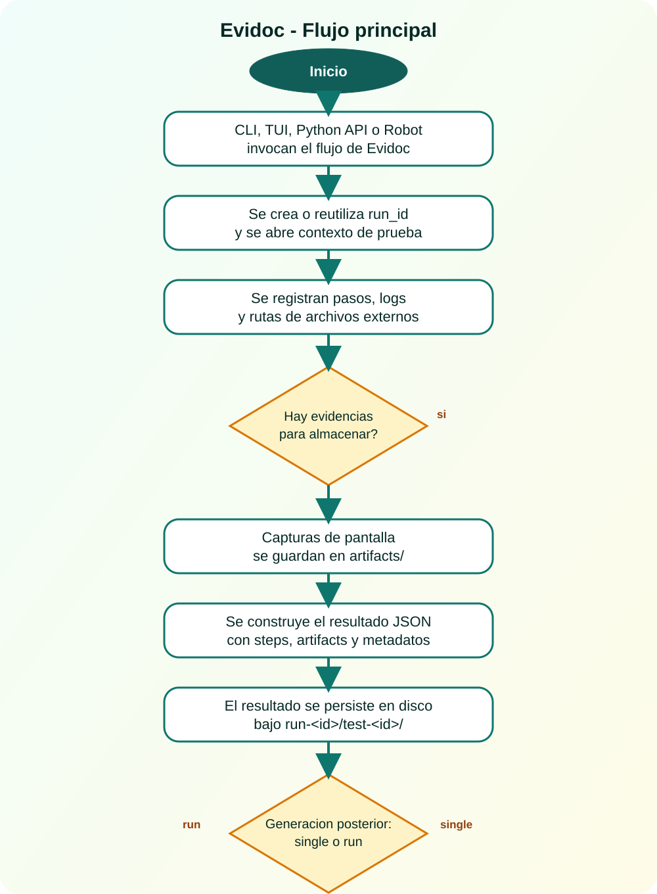

# Arquitectura tecnica

## Objetivo

Esta vista documenta la arquitectura de Evidoc con una convencion compatible con PlantUML. El objetivo es que la estructura tecnica quede versionada junto al proyecto y que los diagramas puedan mantenerse como codigo.

## Convencion adoptada

- Los archivos fuente UML viven en `docs/uml/` con extension `.puml`.
- Los SVG consumidos por MkDocs viven en `docs/assets/images/`.
- Cada diagrama mantiene nombres paralelos entre fuente y render.
- El archivo `.puml` es la fuente de verdad; el `.svg` es el artefacto listo para documentacion.

!!! info "Regla de mantenimiento"
    Cuando cambie la arquitectura o el flujo documentado, primero se actualiza el archivo `.puml` y despues se regenera el `.svg`. MkDocs referencia el SVG versionado y no depende de render dinamico en el build.

## Diagrama de arquitectura general

El proyecto sigue una separacion clara entre interfaces, capa de aplicacion, dominio e infraestructura. Las interfaces activan casos de uso o servicios; la capa de aplicacion depende de puertos; y la infraestructura aporta implementaciones concretas para filesystem, configuracion, reportes y warnings.

[Fuente PlantUML](../uml/arquitectura-general.puml)



## Diagrama de flujo principal

El flujo principal conserva la misma narrativa explicada en el modelo operativo: una interfaz inicia el proceso, Evidoc abre contexto, registra evidencia, persiste resultados estructurados y despues genera salidas PDF o DOCX segun el modo seleccionado.

[Fuente PlantUML](../uml/flujo-operativo.puml)



## Como regenerar los diagramas

Si PlantUML esta disponible localmente, los SVG pueden regenerarse desde la raiz del proyecto con un comando equivalente a este:

```bash
java -jar plantuml.jar -tsvg docs/uml/arquitectura-general.puml docs/uml/flujo-operativo.puml
```

Si el ejecutable `plantuml` esta instalado en el `PATH`, el comando equivalente seria:

```bash
plantuml -tsvg docs/uml/arquitectura-general.puml docs/uml/flujo-operativo.puml
```

En ambos casos, los SVG generados deben copiarse o emitirse en `docs/assets/images/` para que MkDocs siga consumiendo artefactos estaticos versionados.
