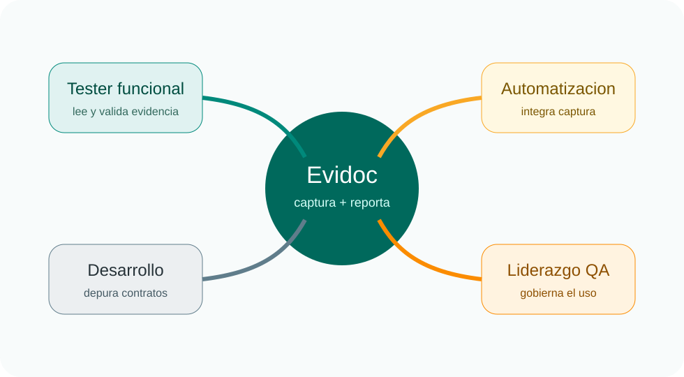

# Que es Evidoc

## Definicion corta

Evidoc es un motor de evidencia de pruebas que guarda resultados estructurados en disco y despues los transforma en reportes PDF o DOCX.

## Lo importante para usuarios finales

Evidoc no intenta reemplazar tu framework de pruebas. Su responsabilidad es otra:

- Recibir eventos de ejecucion.
- Persistir evidencia con estructura estable.
- Relacionar pasos, logs y artefactos.
- Generar un entregable que alguien no tecnico pueda leer.

## Lo que Evidoc no hace

!!! warning "Limites actuales"
    Evidoc no ejecuta pruebas por si mismo, no agenda ejecuciones, no versiona evidencia y no modela suites complejas como entidad de primer nivel. Su centro es la **prueba individual** y la **ejecución** en la que esa prueba vive.

## Resultado mental correcto

Piensa en Evidoc como una proceso de dos etapas:

1. **Captura**: una prueba produce un resultado JSON y una carpeta de artefactos.
2. **Presentacion**: el motor toma esos resultados y genera reportes PDF o DOCX.

